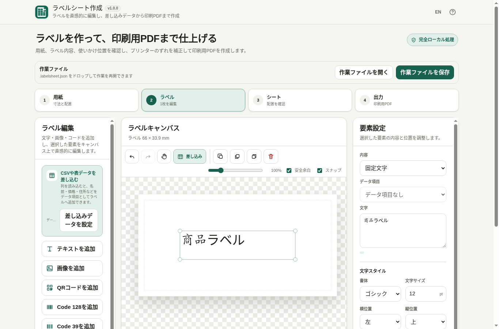

# Label Sheet Maker / ラベルシート作成

[](https://github.com/ttomohisa/htmlapps-label-sheet-maker/actions/workflows/deploy-pages.yml)
[](LICENSE)
[](https://ttomohisa.github.io/htmlapps-label-sheet-maker/)

[English README](README.md)

ラベル用紙の実寸を設定し、1枚のラベルを編集し、CSV / TSVの差し込み、使いかけ用紙への配置、印刷用PDF作成までを、ファイルを外部へアップロードせずブラウザー内で行える単一HTMLアプリです。

## 🚀 デモ

### [GitHub PagesでLabel Sheet Makerを開く](https://ttomohisa.github.io/htmlapps-label-sheet-maker/)

GitHub Pagesから最初のHTMLを読み込んだ後、用紙寸法の計算、ラベル編集、CSV / TSV解析、ローカル画像、QR・バーコード生成、作業ファイルの保存・復元、PDF生成は端末内で処理されます。アプリで選択・入力したファイルや値を、このアプリからサーバーへアップロードすることはありません。

[](https://ttomohisa.github.io/htmlapps-label-sheet-maker/)

## 主な機能

- **実際の寸法でラベル用紙を定義** — A4 / Letter / カスタム用紙、メーカー名に依存しない汎用プリセットを使い、ラベル寸法、行列、余白、間隔をmmまたはinchで調整できます。
- **1枚のラベルをキャンバス上で編集** — テキスト、ローカルPNG / JPEG / WebP画像、QRコード、Code 128、Code 39を追加し、移動・リサイズ・複製・前後移動・削除・Undo / Redoをその場で行えます。
- **ローカルデータを差し込み** — UTF-8 / UTF-8 BOM / Shift_JISのCSV・TSVを読み込むほか、ドラッグ＆ドロップや表データ貼り付けにも対応。列をテキストやコードへ割り当てられます。
- **使いかけ用紙を再利用** — 1ページ目で既に剥がした位置を手動指定し、空いている位置だけへデータ順を保って自動配置します。2ページ目以降は新品シートとして扱います。
- **印刷位置を補正** — X/Yを0.1mm単位で調整し、名前付き補正プリセットを端末内へ保存。ラベル枠・中央マーク・位置番号入りの位置合わせ用PDFも作成できます。
- **印刷用PDFをローカル生成** — A4 / Letter / カスタム用紙に対応し、最終ページプレビューと「実際のサイズ / 100%」での印刷案内を表示します。
- **作業を1ファイルで再開** — 用紙設定、ラベル要素、埋め込み画像、差し込みデータ、使用済み位置、出力設定を `.labelsheet.json` に保存して後から復元できます。
- **PC・スマホの編集操作に対応** — PCではテキストをダブルクリックして直接編集。スマホでは選択要素の固定アクションバーと長押しメニューを利用できます。スナップはON/OFFでき、ドラッグ中に `Alt` を押すと一時的に無効化できます。
- **完全ローカル処理の単一HTML** — 日本語 / 英語UI、登録不要、実行時CDN・analytics・telemetry・外部フォントなし。Content Security Policyは `connect-src 'none'` です。

## すぐに使う

### Webで使う

[デモを開く](https://ttomohisa.github.io/htmlapps-label-sheet-maker/)だけで利用できます。インストールやアカウント登録は不要です。

### HTMLをダウンロードして使う

1. このリポジトリまたはビルド成果物から `dist/index.html` をダウンロードします。
2. 最新のChromiumベースブラウザー、Firefox、Safariで開きます。
3. ローカルWebサーバーを立てず、HTMLファイルを直接開いて利用できます。

`dist/index.self-extract.html` も用意しています。同じアプリをgzip圧縮して内包した自己解凍式の単一HTMLで、ブラウザー内だけで展開します。

### ビルドして完全オフラインで使う（advanced）

1. このリポジトリをダウンロードまたはクローンします。
2. Windowsで `build-standalone.bat` をダブルクリックします。
3. リポジトリ検証後、`dist/` に単一HTMLが生成されます。
4. `dist/index.html` または `dist/index.self-extract.html` を任意の場所へコピーします。
5. 以降はその1ファイルをインターネット接続なしで開けます。

標準のWindowsビルドにPython、Node.js、ローカルWebサーバーは不要です。Windows PowerShellを使用します。

## 使い方

1. **用紙**で汎用プリセットを選ぶか、A4 / Letter / カスタム用紙を指定し、ラベル幅・高さ、行列、余白、間隔を入力します。
2. シートのライブプレビューと、自動計算された右余白 / 下余白を確認します。
3. **ラベル**でテキスト、画像、QRコード、Code 128、Code 39を追加します。要素枠をドラッグして移動し、四隅のハンドルでリサイズします。
4. 内容を変えるラベルでは、**差し込みデータ**からCSV / TSVまたは表貼り付けを読み込み、列をデータ項目として追加します。
5. 行プレビューを切り替え、差し込みテキストやコードの内容を確認します。
6. **シート**で、1ページ目の既に使用したラベル位置をタップします。新しいラベルは空いている位置だけへ順番に配置されます。
7. 2ページ目以降の配置を確認します。2ページ目以降は新品シートとして扱われます。
8. **出力**で、必要なら位置合わせ用PDFを作成してX/Y補正を調整し、補正値をプリセットとして保存します。
9. 印刷用PDFを作成し、印刷時は**実際のサイズ / 100%**を使用します。
10. 上部の**作業ファイルを保存**から現在の作業を `.labelsheet.json` に保存し、後から**作業ファイルを開く**またはドラッグ＆ドロップで再開できます。

内蔵プリセットは物理寸法と行列を表す汎用設定です。メーカー公式テンプレートではありません。

### ラベルエディタの操作

- 要素をクリック / タップすると選択できます。
- 要素枠をドラッグすると移動できます。
- 四隅のハンドルをドラッグするとリサイズできます。タッチ端末では、見た目より大きい透明なタップ領域を確保しています。
- PCでは固定文字のテキストをダブルクリックすると文字入力欄へ移動し、全文が選択されます。
- キャンバス上の要素操作から、編集・複製・前面へ・背面へ・削除を実行できます。
- スマホでは要素を選択すると、4工程タブの上に固定アクションバーが表示されます。
- タッチ端末で要素を長押しするとコンテキストメニューを開けます。指を動かすと長押し判定は解除され、通常のドラッグになります。
- スナップはキャンバス上部でON/OFFできます。ドラッグ中に `Alt` を押している間だけ一時的にスナップを無効化できます。

### キーボード操作

| ショートカット | 操作 |
| --- | --- |
| `Ctrl` / `⌘` + `Z` | 元に戻す |
| `Ctrl` / `⌘` + `Shift` + `Z` | やり直す |
| `Delete` / `Backspace` | 選択要素を削除 |
| `Esc` | 選択解除 |
| `←` / `→` / `↑` / `↓` | 選択要素を0.2mm移動 |
| `Shift` + 矢印キー | 選択要素を1mm移動 |
| `Alt` + ドラッグ | 一時的にスナップを無効化 |

要素を削除した直後は、トーストの**元に戻す**から復元できます。

## GitHub Pagesで公開する

このリポジトリには、単一HTMLをビルド・検証して `dist/` をGitHub Pagesへ公開するワークフローが含まれています。

1. リポジトリを `htmlapps-label-sheet-maker` としてGitHubへプッシュします。
2. **Settings → Pages → Build and deployment → Source** で **GitHub Actions** を選択します。
3. `main` へプッシュするか、Actions画面から **Deploy standalone app to GitHub Pages** を手動実行します。
4. デプロイ成功後、`https://ttomohisa.github.io/htmlapps-label-sheet-maker/` で利用できます。

`main` へのプッシュ時は、Pages公開前にリポジトリ検証が実行されます。ビルド入力に関係するPull Requestでは **Validate standalone HTML** が実行されます。

## 開発とビルド

```text
.
├─ src/index.template.html       # アプリ本体のテンプレート
├─ app.config.json               # アプリ情報とビルド設定
├─ dependencies.json             # 実行時依存定義（現在は空）
├─ build-standalone.bat          # Windows用ビルド入口
├─ build-standalone.ps1          # 単一HTML生成処理
├─ scripts/                      # 検証・自己解凍版生成補助
├─ tests/                        # Core / Static / UX / Release回帰テスト
├─ dist/
│  ├─ index.html                 # 読みやすい単一HTML版
│  └─ index.self-extract.html    # gzip自己解凍式の単一HTML版
└─ .github/workflows/
   ├─ build-standalone.yml       # Pull Request時のビルド検証
   └─ deploy-pages.yml           # mainからPagesへ自動公開
```

編集するのは `src/index.template.html` です。`dist/` の生成済みHTMLを直接編集しないでください。

### Windowsでビルド

```bat
build-standalone.bat
```

ビルド処理ではPowerShell構文、リポジトリ構造、通常版単一HTML、自己解凍版を検証し、`dist/` にビルド・依存関係のマニフェストも生成します。

### テスト

用紙計算、ラベルエディタ、差し込みデータ、画像・コード、シート配置、PDF出力、作業ファイル、スマホUX、長押し、正式リリース条件を対象に回帰テストがあります。

開発時にNode.jsがある場合は、全テストをまとめて実行できます。

```bash
for file in tests/*.test.mjs; do node "$file"; done
```

Windows PowerShellの場合:

```powershell
Get-ChildItem tests\*.test.mjs | ForEach-Object { node $_.FullName }
```

## プライバシーと外部通信防止

このアプリは、ラベル作成に使うユーザーデータを**完全ローカル処理**する構成です。

- Content Security Policyに `connect-src 'none'` を指定
- 実行時CDN、API通信、analytics、telemetry、外部フォントなし
- CSV / TSV、貼り付け表、ローカル画像、QR・バーコード内容、作業ファイル、PDF生成はブラウザー内で処理
- カスタム用紙設定と印刷補正プリセットはブラウザーのサイトデータへ保存
- `.labelsheet.json` は端末内で生成され、作業再開に必要な画像や差し込みデータも含められます

GitHub Pages版では最初のHTMLを取得する通信は発生しますが、読み込み後に選択・入力したデータをこのアプリからアップロードしません。ネットワークを完全に切って使う場合は、生成済み `dist/index.html` をローカルで開いてください。

## 制限事項

- 内蔵レイアウトは汎用の寸法プリセットで、ラベル用紙メーカーが提供する公式テンプレートではありません。印刷前に実際の用紙寸法を確認してください。
- 印刷用PDFは見た目と位置精度を優先して約300dpiでページを描画します。PDF内の文字を検索・編集できることは目的としていません。
- Code 128は現在Set Bを使用し、印字可能なASCII文字に対応します。Code 39は英大文字・数字・空白・対応記号を使用できます。
- QRコードはUTF-8文字列から生成しますが、印刷サイズが小さすぎると読み取りにくくなる場合があります。
- 画像入力は端末内のPNG / JPEG / WebPに対応します。SVG画像入力や外部画像URLは未対応です。
- CSV / TSVと表貼り付けに対応します。v1.0.0ではXLSX、Google Sheetsには対応していません。
- 使いかけ用紙の使用済み位置は手動で指定します。カメラによる自動検出はありません。
- PDFは生成できますが、プリンタードライバーやプリンター本体を直接制御しません。最終的な位置精度は給紙精度や印刷ダイアログの倍率にも影響されます。
- 非常に大きいカスタム用紙、多数の高解像度画像、大量の差し込みデータではブラウザーのメモリを多く使用する場合があります。
- 作業ファイルには画像や差し込みデータが含まれる場合があります。機密情報を含む作業ファイルの保管・共有には注意してください。

## 第三者由来コード

| コンポーネント | ライセンス | 用途 |
| --- | --- | --- |
| Project Nayuki QR Code generatorのアルゴリズム（一部を適応） | MIT | QRエンコードと誤り訂正構造 |

Code 39 / Code 128は公開されているシンボル構造をもとにローカル実装しており、外部バーコードランタイムは同梱していません。`dependencies.json` の実行時パッケージ依存は現在0件です。

詳細は [THIRD_PARTY_NOTICES.md](THIRD_PARTY_NOTICES.md) を確認してください。

QRコードは株式会社デンソーウェーブの登録商標です。

## コントリビューション

バグ報告や機能提案はGitHub Issuesからお願いします。開発への参加方法は [CONTRIBUTING.md](CONTRIBUTING.md) を確認してください。

## ライセンス

Copyright © 2026 ttomohisa

このプロジェクトは [MIT License](LICENSE) で公開されています。
