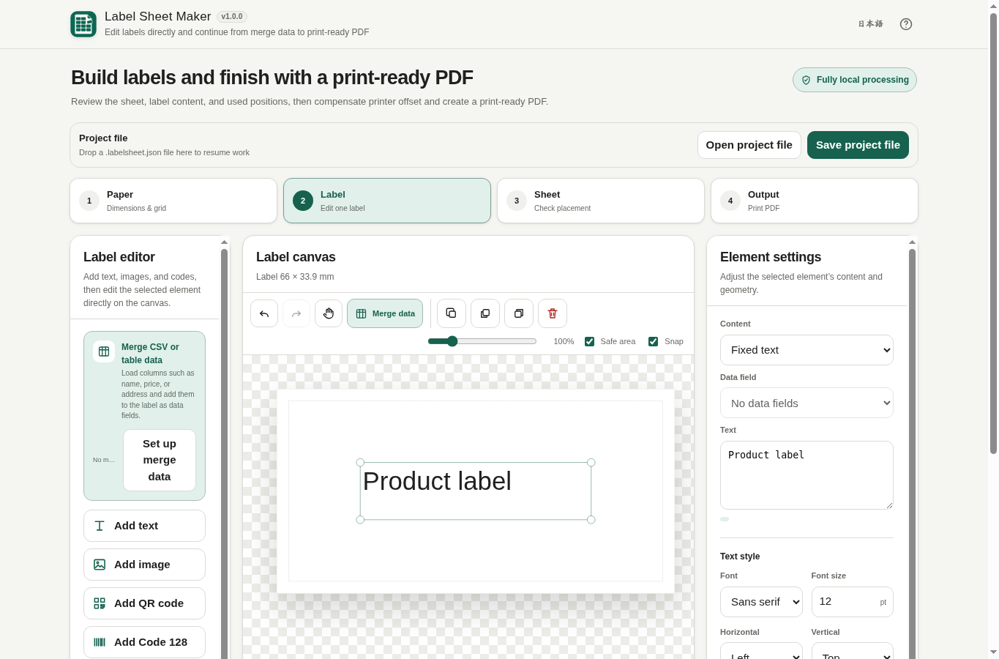

# Label Sheet Maker

[](LICENSE)
[](https://ttomohisa.github.io/htmlapps-label-sheet-maker/)

[日本語 README](README.ja.md)

A browser-only tool for matching label-sheet dimensions, composing labels with local data and media, and placing them across partially used or fresh sheets.

**v1.0.0 is the stable release.** The full Paper → Label → Sheet → Output workflow is available locally in the browser, including merge data, images/codes, used-label positions, calibration/PDF output, project files, and the finished desktop/mobile label-editor interactions.



## Features

- A4, Letter, and custom paper sizes
- Millimetre / inch display with millimetre-based internal geometry
- Manufacturer-neutral built-in layout presets
- Live SVG preview with label numbering
- Automatic right/bottom margin calculation
- Overflow and invalid-value validation
- Named custom layouts stored locally in the browser
- SVG one-label editor with physical millimetre coordinates
- Full-frame drag movement, four-corner resize, and clear move/resize cursors
- Contextual canvas icon actions for duplicate / front / back / delete
- Smartphone fixed selected-element action bar and touch long-press context menu
- Local font choices including Meiryo, Yu Gothic, Yu Mincho, Hiragino families, rounded Gothic, monospace, and generic fallbacks
- Font size, bold, horizontal/vertical alignment, wrapping
- 50–300% zoom, pan mode, safe-area guide, snap on/off, Undo / Redo
- Reliable Delete / Backspace after canvas selection, 0.2 mm Arrow nudging, 1 mm Shift+Arrow nudging, temporary Alt+drag snap bypass, and Escape deselection
- Merge-data entry points in the canvas toolbar and label tools
- UTF-8 / UTF-8 BOM / Shift_JIS CSV and TSV loading
- Drag & drop plus pasted spreadsheet-table input
- Row preview navigation and column-to-label data fields
- Repeat-label and data-merge modes
- Local PNG / JPEG / WebP image elements with contain / cover fitting
- UTF-8 QR codes with fixed values or merged data fields
- Code 128 Set B and Code 39 vector barcodes with validation
- Full-sheet composition using the physical paper geometry
- Manual used-position selection for partially used first sheets
- Fill only available positions while preserving data order
- Multi-page calculation with fresh sheets from page 2 onward
- X/Y printer calibration in 0.1 mm steps with named local presets
- Calibration PDF with label outlines, center marks, and position numbers
- 300 dpi print-ready PDF generation for A4, Letter, and custom paper sizes
- Page-by-page final print preview and explicit 100% / Actual Size guidance
- Portable `.labelsheet.json` project save / restore with embedded local images and merge data
- Project schema versioning with invalid / unsupported file errors
- Japanese / English UI
- Desktop workflow navigation and smartphone bottom page tabs
- No runtime CDN, API, analytics, telemetry, or remote font
- Readable single-HTML build and gzip self-extracting single-HTML build

All four workflow steps — **Paper, Label, Sheet, Output** — remain functional, and v1.0.0 adds direct double-click text editing, a mobile edit button, delete Undo, and snap guides on top of the v0.8 canvas and merge-data refinements.

## Usage

1. Open the **Paper** step.
2. Choose a generic layout preset, or select A4 / Letter / Custom and enter dimensions.
3. Adjust label width/height, rows/columns, margins, and gaps.
4. Check the live preview and calculated right/bottom margins.
5. Open **Label**, add an element, drag its frame to move it, resize from the corners, and use the contextual icon actions above the canvas.
6. For CSV / TSV or pasted tables, use **Merge data** from the label tools or canvas toolbar, then add loaded columns as data fields.
7. Add local images, QR codes, Code 128, or Code 39 as needed. Codes can use fixed values or loaded data fields.
8. Use the row controls to preview how merged text and code values change.
9. Open **Sheet**, tap positions that are already used on the first physical sheet, and review the placement order.
10. Move between automatically calculated pages; page 2 and later are treated as fresh sheets.
11. Open **Output**, create a calibration PDF if needed, and adjust X/Y offsets in 0.1 mm steps.
12. Generate the print-ready PDF and print it at **Actual size / 100%**.
13. Save frequently used paper geometry and printer calibration as local presets.
14. Use **Save project file** to export the entire current job as `.labelsheet.json`; reopen it later with **Open project file** or drag it onto the project bar.

Built-in presets describe only physical dimensions and grid counts. They are not manufacturer-official templates.

## Privacy

Label-sheet settings, loaded CSV / pasted table data, local images, code values, calibration values, project-file save / restore, and PDF generation are processed in the browser. This app does not upload entered values, files, images, or saved layouts.

The default Content Security Policy keeps `connect-src 'none'`. The release contains no runtime external library or font dependency.

Custom layouts are stored in browser storage. Clearing site/browser data may remove them.

## Current scope

v1.0.0 keeps the complete print workflow and portable project files, and completes the editor UX with direct text editing, delete Undo, snap guides with an on/off toggle, Alt snap bypass, a fixed mobile action bar, and a touch long-press menu:

1. Paper geometry
2. Label editor
3. CSV / pasted-table merge
4. Used-position sheet composition
5. Printer X/Y calibration
6. Print-ready PDF output
7. Portable project save / restore

See [APP_SPEC.md](APP_SPEC.md) for the full product scope and explicit exclusions.

## Browser support

Primary targets:

- Google Chrome
- Microsoft Edge
- Android Chrome

The generated readable HTML is designed to open directly with `file://` and without network access.

## Development

This repository follows the Browser Kitty single-HTML template contract.

- Edit `src/index.template.html`, not generated files under `dist/`.
- Product metadata lives in `app.config.json`.
- Product behavior and acceptance criteria live in `APP_SPEC.md`.
- No runtime CDN, package fetch, or remote font is required in v1.0.0; QR, sheet composition, project serialization, rasterization, and PDF writing are embedded in the single HTML build.

### Tests

```bash
node tests/v0.1-core.test.mjs
node tests/v0.1-static.test.mjs
node tests/v0.2-editor-core.test.mjs
node tests/v0.2-static.test.mjs
node tests/v0.3-data-core.test.mjs
node tests/v0.3-static.test.mjs
node tests/v0.4-media-core.test.mjs
node tests/v0.4-static.test.mjs
node tests/v0.5-sheet-core.test.mjs
node tests/v0.5-static.test.mjs
node tests/v0.6-output-core.test.mjs
node tests/v0.6-static.test.mjs
node tests/v0.7-project-core.test.mjs
node tests/v0.7-static.test.mjs
node tests/v0.8-editor-ux.test.mjs
node tests/v0.8.2-mobile-ux.test.mjs
node tests/v0.9-release-candidate.test.mjs
node tests/v1.0-mobile-ux.test.mjs
node tests/v1.0-longpress-release.test.mjs
node tests/v1.0-release.test.mjs
```

### Build on Windows

```bat
build-standalone.bat
```

This generates:

```text
dist/
├─ index.html
├─ index.self-extract.html
├─ dependency-manifest.json
├─ build-size-report.json
├─ self-extract-manifest.json
└─ .nojekyll
```

## Trademark note

QR Code is a registered trademark of DENSO WAVE INCORPORATED.

## License

MIT License. See [LICENSE](LICENSE). Third-party notices are listed in [THIRD_PARTY_NOTICES.md](THIRD_PARTY_NOTICES.md).
